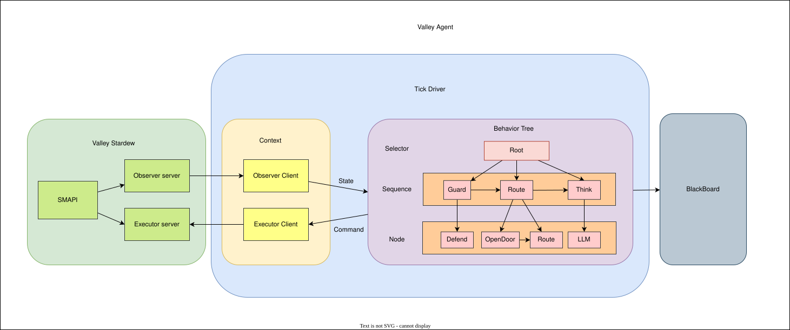

# Valley Agent

Valley Agent 是一个让 AI 自主游玩《星露谷物语》的实验项目。项目当前采用“行为树 + AI 决策 + SMAPI 结构化状态”的架构：AI 负责决定宏观目标；行为树负责实时调度，确定性算法和游戏技能负责执行与验证；SMAPI 用于底层的游戏行为实现。

当前入口文件是 `main.py`。

## 项目目标

自主规划并完成《星露谷物语》中的长期任务，包括导航、交互、种植、采集、交易、战斗和日程管理。

项目不会让 LLM 直接控制每一帧按键。实时动作由行为树、A\*、确定性节点和 SMAPI 状态验证完成；LLM 只负责低频的高层计划、失败反思和记忆。

## 当前阶段

当前第一阶段主线仍是完成智能寻路 MVP，并使用 `LLM_Node` 返回的模拟任务验证完整执行闭环。这里的“智能寻路”包括避障、动态重规划、破坏障碍物、开门，以及从最新游戏状态验证到达结果。

阶段进度、已知缺口、验收标准和开发顺序见：

- `docs/current-stage.md`

## 系统架构



- 运行中心是 `ValleyAgent` 的 tick driver。
- `PlayerContext` 是上下文模块，提供 `observer client`、`Executor client`、最新 `State` 和待执行 `Command` 的通道。
- `observer server -> observer client -> State -> BT` 是状态输入链路；`BT -> Command -> Executor client -> Executor` 是动作输出链路。
- `AgentBlackboard` 在 BT 外侧承担计划、进度和跨节点信号协作；BT 每个 tick 读取 state 与 blackboard 后决定当前节点行为。
- `PlayerContext` 额外持有运行期 `MapKnowledgeCache`，用于保存水源、未来采集物等低频地图知识；它不同于每帧 state，也不同于 blackboard 的调度信号。

## 当前能力概览

项目当前重点验证以下能力：

- 跨场景导航、局部路径跟随和动态重规划。
- 基础农业任务闭环，包括区域规划、地块处理和结果验证。
- 基础资源管理任务闭环。
- 运行期地图知识缓存，为低频查询和后续机会记忆预留接口。

更细的行为树节点边界、状态机、协议约束和阶段验收见 `AGENTS.md` 与 `docs/current-stage.md`。

## 目录结构

```text
valley-agent/
├── main.py                         # 当前入口
├── agent/
│   ├── valley_agent.py             # 主循环和行为树装配
│   ├── base_task.py                # 基础任务类型
│   ├── behavior_tree/              # 节点、黑板和玩家上下文
│   ├── action/map/                 # 硬编码场景连通图和跨场景候选路线
│   ├── action/valley_action/       # 动作模型、A*、局部移动和交互站位控制
│   ├── memory/                     # 运行期地图知识缓存和长期记忆预留接口
│   └── prompt/                     # Planner 提示词
├── server/
│   └── valley_server.py            # Python TCP 客户端与状态解析
├── StardewMemoryExporter/          # SMAPI Observer/Executor Mod
├── skills/                         # 项目内 Codex Skills
├── docs/
│   └── current-stage.md            # 当前阶段目标、进度和验收
├── scripts/                        # 环境和日志脚本
├── AGENTS.md                       # Agent 开发约束
└── README.md
```

## 环境与运行

项目当前使用：

- macOS
- Stardew Valley 1.6 + SMAPI
- Conda 环境名：`valley`
- Python：`3.13.5`
- .NET / C# SMAPI Mod

安装并运行 Python Agent：

```bash
./setup.sh
```

环境已经准备好时可以直接运行：

```bash
conda activate valley
python main.py
```

构建并部署 SMAPI Mod：

```bash
./StardewMemoryExporter/setup.sh
```

首次运行会由 `scripts/init_env.py` 创建 `.env`。当前主要配置包括：

```dotenv
SMAPI_SEVER_HOST=127.0.0.1
SMAPI_OBSERVER_SERVER_PORT=9999
SMAPI_EXECUTOR_SEVER_PORT=8888
GOOGLE_API_KEY=<Your_Google_API_Key>
```

变量名中的 `SEVER` 是当前代码已经使用的历史拼写，修改前需要同步迁移消费端。不要提交真实 API Key。

## 项目 Skills

项目内 Codex Skill 不保证被自动发现。使用 Codex 开发时，应根据任务显式读取：

- `skills/code-style/SKILL.md`：编码、协议和验证规范。
- `skills/behavior-tree/SKILL.md`：行为树节点契约、模板和示例。
- `skills/documentation/SKILL.md`：文档边界、更新流程和 README 粒度规范。

完整的强制加载规则见 `AGENTS.md`。

## 后续路线

完成智能寻路 MVP 后，再逐步推进：

1. 将 `main.py` 的自然语言任务稳定注入 Planner。
2. 用类型化 Plan Schema 替换模拟计划。
3. 接入真实 LLM 进行宏观任务生成和失败恢复。
4. 扩展时间、金钱、体力、菜单、作物、天气和 NPC 状态。
5. 完善种植、浇水、收获、采集、购买、战斗和日程管理技能。
6. 建立离线回放、半实时场景和游戏内端到端 Benchmark。
